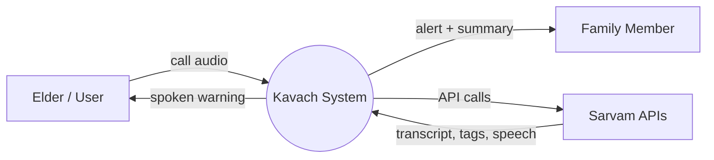
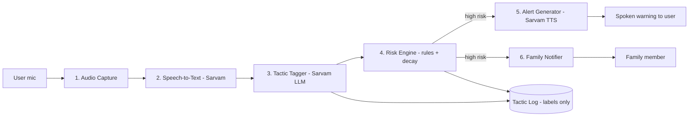

# Data Flow Diagrams

Render at https://mermaid.live and export PNGs into `docs/`.

## Level 0

```mermaid
flowchart LR
  U[Elder / User] -- call audio --> K((Kavach System))
  K -- spoken warning --> U
  K -- alert + summary --> F[Family Member]
  K -- API calls --> S[Sarvam APIs]
  S -- transcript, tags, speech --> K
```

## Level 1

```mermaid
flowchart LR
  U[User mic] --> P1[1. Audio Capture]
  P1 --> P2[2. Speech-to-Text - Sarvam]
  P2 --> P3[3. Tactic Tagger - Sarvam LLM]
  P3 --> P4[4. Risk Engine - rules + decay]
  P4 -->|high risk| P5[5. Alert Generator - Sarvam TTS]
  P4 -->|high risk| P6[6. Family Notifier]
  P5 --> U2[Spoken warning to user]
  P6 --> F[Family member]
  P3 --> D1[(Tactic Log - labels only)]
  P4 --> D1
```
